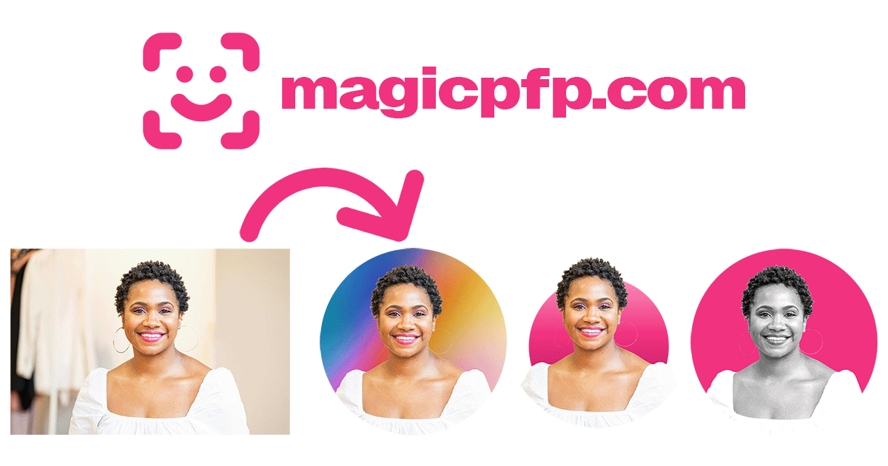

# magicpfp.com
## About
[magicpfp.com](https://magicpfp.com/) is a small webapp for generating and customizing headshot profile-pictures. 
It uses a background-removal machine learning model ([briaai/RMBG-1.4](https://huggingface.co/briaai/RMBG-1.4)), that **runs directly in the browser**, utilizing WebGPU if available.

The project features a [rich editor](https://magicpfp.com/editor) to customize profile pictures with addons like custom backgrounds, badges, image filters, and more.

## Develop
⚠️ Check out the `dev` branch! Development happens on the `dev` branch! ⚠️

* run dev-server: `pnpm dev`
* build: `pnpm build`
* lint: `pnpm lint`

Live version of the dev branch: https://dev.magicpfp.pages.dev/

## Credits
* Default Background Gradients from https://unsplash.com/@vinhundred
* Example Headshots on Frontpage from:
  * https://unsplash.com/@jimmyferminphotography
  * https://unsplash.com/@alexstarnes
  * https://unsplash.com/@darshanp9
* AI Model from https://huggingface.co/briaai/

## License
MIT License, see [LICENSE](LICENSE)
